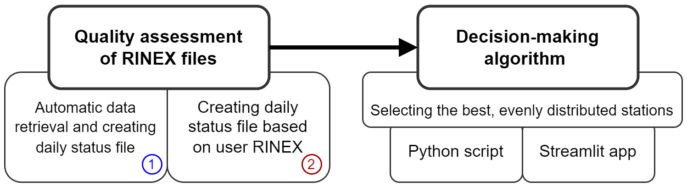

# RINEXAV - GNSS Pernament Station Selection System Based on Qualitative Analysis of RINEX files
 
Install the latest Python version
The Python can be found in the following link: https://www.python.org/downloads/. 
A Python version 3.8 or higher is recommended.
If you are using the GFZRNX software, download it (https://gnss.gfz.de/services/gfzrnx) and place the .exe file in the appropriate folder.
After the successful installation of Python, the user should install several packages that are required for the execution of the optimization code. 
Installation of packages should be done in the up-to-date versions.
<li>pandas</li>
<li>numpy</li>
<li>shutil</li>
<li>ftplib</li>
<li>datetime</li>
<li>gzip</li>
<li>re</li>
<li>subprocess</li>
<li>time</li>
<li>sklearn</li>
<li>streamlit</li>
<li>streamlit_folium</li>
<li>base64</li>
<li>branca</li>
<li>folium</li>
 
This work was supported by the National Science Centre, Poland (NCN), Grant No. UMO-2021/42/E/ST10/00020.
