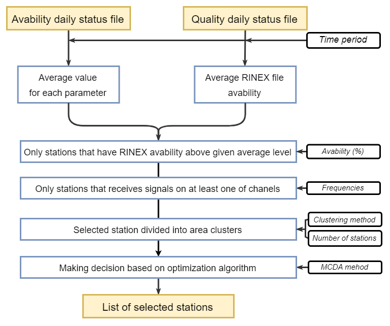

# make_decision
<h2>Module to making decision based on daily status file generated by status_file_automatic and status_file_from_folder</h2> 
<li>main file to run script: make_decision.py </li>
<li>dataset uses in software: data_to_script (daily status files) </li>
<h3>Processing diagram</h3> 
 
<h4>Example input in make_decision:</h4>
<li>date = datetime.date(2022,1,1) #start date of period</li>
<li>lastDate = datetime.date(2022,1,31) #end date of period</li>
<li>sys_bar = ['C', 'G'] #system for which data from</li>
<li>freq_done =  [('C', '2I'), ('C', '1X')] #frequencies for selected dataset</li>
<li>weights = [1, 1, 1, 1, 1] #weight of parameters [Priority Level, SNR, Number of observations, GAPS, MULTIPATH]</li>
<li>ileprocent = 90 #above which percentage of RINEX file availability the stations have to be taken for analysis </li>
<li>clustering_method = "KMeans" #clustering method "KMeans" or "AgglomerativeClustering"</li>
<li>MDCA_method = "TOPSIS" #mMulti decision making method "TOPSIS" or "COPRAS"</li>
<li>num_points = 100 #how how many stations will be selected </li>

<h4>Software export csv file:</h4>
<li>selected stations with statistics /li>
<li>all stations with statistics</li>