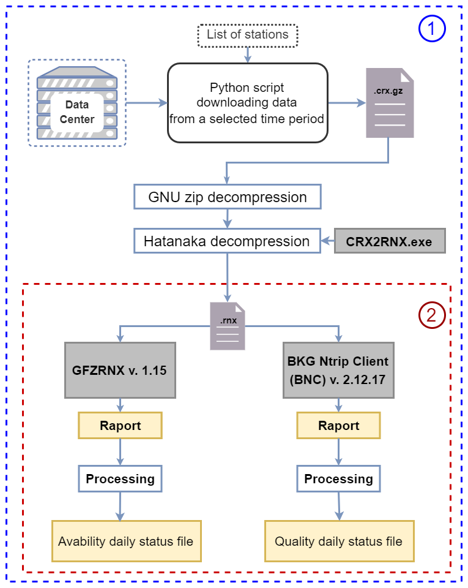

# status_file_from_folder.py
<h2>Module to generating status file based on RINEX file from data folder</h2> 
<h3>The running of the script is possible after installing BKG NTrip Client (https://igs.bkg.bund.de/ntrip/bnc).</h3>
<li>main file to run script: status_file_from_folder.py </li>
<li>dataset uses in software: data_to_script (daily status files) </li>
<h3>Processing diagram</h3> 
 
<h4>Software export to data folder csv file with:</h4>
<li>avability daily status file</li>
<li>quality daily status file</li>